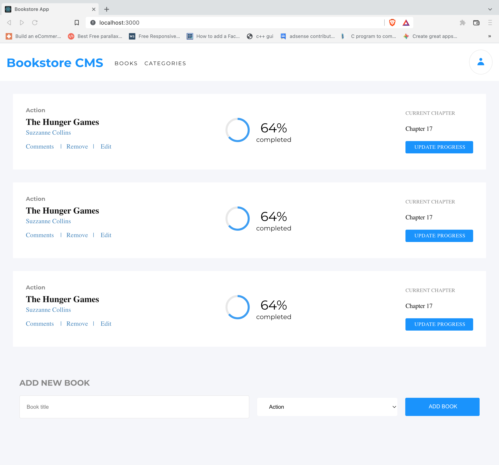

# The React BookStore CMS App.

> This app helps you perform math operations.

## Built With

- HTML, CSS and Js (ES6).
- Using React Framework
- Webpack
- Git, Github and VsCode.
- Jest framework for testing

### Live Demo

- Not yet available.

## Getting Started

To get a local copy up and running follow these simple example steps.

### Prerequisites

- A modern upto-date browser
- Text Editor or IDE

### Setup

1.  Clone the Repo or Download the Zip file or `https://github.com/billionsjoel/react-book-store.git`.
2.  `cd/react-book-store`

### Install

After cloning the project you need to run these commands

- `npm install` `This command will download all the dependancies of the project`
- `npm run start`

### Run Tests

  - `npm run test`

## Authors

👤 ** Atugonza Billions joel **

- GitHub: [@billionsjoel](https://github.com/billionsjoel)
- Twitter: [@billionsjoel](https://twitter.com/BillionsJoel)
- LinkedIn: [billionsjoel](https://www.linkedin.com/in/billionsjoel/)

## 🤝 Contributing

Contributions, issues, and feature requests are welcome!

Feel free to check the [issues page](https://github.com/billionsjoel/react-book-store/issues).

## Show your support

Give a ⭐️ if you like this project!

## Acknowledgments

- Hat tip to anyone whose code was used
- Inspiration
- etc

## 📝 License

This project is [MIT](./MIT.md) licensed.
